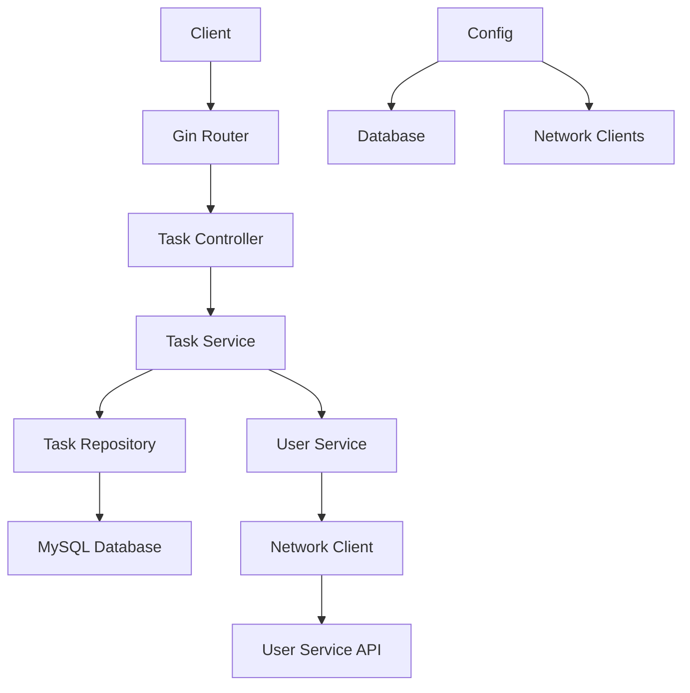

# Task Manager API

A RESTful microservice for task management built with Go, Gin framework, and PostgreSQL database. This service demonstrates microservices architecture patterns including service separation, HTTP-based inter-service communication, and clean architecture principles.

## 📋 Table of Contents

- [Problem Breakdown](#problem-breakdown)
- [Design Decisions](#design-decisions)
- [Architecture Overview](#architecture-overview)
- [Setup Instructions](#setup-instructions)
- [API Documentation](#api-documentation)
- [Microservices Concepts](#microservices-concepts)

## 🎯 Problem Breakdown

### Core Requirements
1. **Task Management**: CRUD operations for tasks with title, description, status, priority, and user assignment
2. **User Validation**: Validate user existence through external user service with string UUID support
3. **Status Management**: Enum-based status validation (Pending, InProgress, Completed)
4. **Priority Management**: Enum-based priority validation (Low, Medium, High, Urgent)
5. **Advanced Filtering**: Multi-parameter filtering by status, user_id, and priority
6. **Data Persistence**: PostgreSQL database with GORM ORM
7. **API Design**: RESTful endpoints with proper HTTP status codes
8. **Error Handling**: Structured error responses with meaningful messages

### Business Logic
- Tasks must have a title (required field)
- Tasks can be assigned to users (validated against user service using string UUIDs)
- Task status follows predefined enum values
- Task priority follows predefined enum values with default "Medium" priority
- Advanced filtering support for listing tasks by multiple criteria
- Pagination support for task listing
- UUID-based task identification for external APIs

## 🏗️ Design Decisions

### 1. **Clean Architecture**
```
Controller → Service → Repository → Database
     ↓
User Service → Network Client → External API
```

### 2. **Service Layer Separation**
- **TaskService**: Handles task business logic and validation
- **UserService**: Abstracts user validation from external service
- **Network Layer**: HTTP client for inter-service communication

### 3. **Request/Response Pattern**
- Unified `ReqCreateOrUpdateTasks` struct for both create and update operations
- Consistent `TaskResponse` structure across all endpoints
- Pointer fields for optional updates

### 4. **Error Handling Strategy**
- Custom error types with HTTP status codes
- Centralized exception handling
- Structured error responses

### 5. **Configuration Management**
- Environment-based configuration
- Centralized application config
- Database connection pooling

## 🏛️ Architecture Overview



## 🚀 Setup Instructions

### Prerequisites
- Go 1.19 or higher
- MySQL 8.0 or higher
- Git

### 1. Clone Repository
```bash
git clone <repository-url>
cd task-manager-app
```

### 2. Install Dependencies
```bash
go mod download
```

### 3. Database Setup
```sql
CREATE DATABASE task_db;
CREATE USER taskuser WITH PASSWORD 'taskpassword';
GRANT ALL PRIVILEGES ON DATABASE task_db TO taskuser;

-- Create tasks table with priority support
CREATE TABLE tasks (
    id SERIAL PRIMARY KEY,
    uuid VARCHAR(255) UNIQUE NOT NULL,
    title VARCHAR(255) NOT NULL,
    description TEXT,
    status VARCHAR(50) NOT NULL DEFAULT 'Pending',
    priority VARCHAR(20) NOT NULL DEFAULT 'Medium',
    user_id VARCHAR(255),
    created_at TIMESTAMP DEFAULT CURRENT_TIMESTAMP,
    updated_at TIMESTAMP DEFAULT CURRENT_TIMESTAMP
);
```

### 4. Environment Configuration
Create/update `resources/.env`:
```env
# Data
# Run with custom environment
docker run -p 8080:8080 \
  -e POSTGRES_HOST=your-db-host \
  -e POSTGRES_USERNAME=taskuser \
  -e POSTGRES_PASSWORD=taskpassword \
  task-manager:latest
# Application Configuration
APP_NAME=TaskManager
APP_VERSION=1.0.0
HOST=localhost
PORT=8080

# User Service Configuration
USER_SERVICE_URL=http://localhost:8081
```

### 5. Run the Service
```bash
go run main.go
```

The service will start on `http://localhost:8080`

### 6. Database Migration
The service automatically creates tables on startup using GORM auto-migration with PostgreSQL.

## 📚 API Documentation

### Base URL
```
http://localhost:8080/api/v1
```

### Endpoints

#### 1. Create Task
```http
POST /tasks
Content-Type: application/json

{
  "title": "Implement user authentication",
  "description": "Add JWT-based authentication to the API",
  "status": "Pending",
  "priority": "High",
  "user_id": "550e8400-e29b-41d4-a716-446655440000"
}
```

**Response (201 Created):**
```json
{
  "uuid": "123e4567-e89b-12d3-a456-426614174000",
  "title": "Implement user authentication",
  "description": "Add JWT-based authentication to the API",
  "status": "Pending",
  "priority": "High",
  "user_id": "550e8400-e29b-41d4-a716-446655440000",
  "created_at": "2025-09-04T00:55:00Z",
  "updated_at": "2025-09-04T00:55:00Z"
}
```

#### 2. Get Task by UUID
```http
GET /tasks/{uuid}
```

**Response (200 OK):**
```json
{
  "uuid": "123e4567-e89b-12d3-a456-426614174000",
  "title": "Implement user authentication",
  "description": "Add JWT-based authentication to the API",
  "status": "Pending",
  "priority": "High",
  "user_id": "550e8400-e29b-41d4-a716-446655440000",
  "created_at": "2025-09-04T00:55:00Z",
  "updated_at": "2025-09-04T00:55:00Z"
}
```

#### 3. Update Task
```http
PUT /tasks/{uuid}
Content-Type: application/json

{
  "title": "Updated task title",
  "status": "InProgress",
  "priority": "Urgent"
}
```

**Response (200 OK):**
```json
{
  "uuid": "123e4567-e89b-12d3-a456-426614174000",
  "title": "Updated task title",
  "description": "Add JWT-based authentication to the API",
  "status": "InProgress",
  "priority": "Urgent",
  "user_id": "550e8400-e29b-41d4-a716-446655440000",
  "created_at": "2025-09-04T00:55:00Z",
  "updated_at": "2025-09-04T01:15:00Z"
}
```

#### 4. Delete Task
```http
DELETE /tasks/{uuid}
```

**Response (204 No Content)**

#### 5. List Tasks with Advanced Filtering
```http
GET /tasks?status=Pending&user_id=550e8400-e29b-41d4-a716-446655440000&priority=High&page=1&pageSize=10
```

**Query Parameters:**
- `status` (optional): Filter by task status (Pending, InProgress, Completed)
- `user_id` (optional): Filter by user UUID (validated against user service)
- `priority` (optional): Filter by priority level (Low, Medium, High, Urgent)
- `page` (optional): Page number for pagination (default: 1)
- `pageSize` (optional): Number of items per page (default: 10)

**Response (200 OK):**
```json
{
  "tasks": [
    {
      "uuid": "123e4567-e89b-12d3-a456-426614174000",
      "title": "Implement user authentication",
      "description": "Add JWT-based authentication to the API",
      "status": "Pending",
      "priority": "High",
      "user_id": "550e8400-e29b-41d4-a716-446655440000",
      "created_at": "2025-09-04T00:55:00Z",
      "updated_at": "2025-09-04T00:55:00Z"
    }
  ],
  "page": 1,
  "pageSize": 10,
  "count": 1
}
```

### Error Responses

#### 400 Bad Request
```json
{
  "timestamp": 1725404100000,
  "message": "invalid task priority given in req",
  "response_code": 400
}
```

#### 404 Not Found
```json
{
  "timestamp": 1725404100000,
  "message": "user not found",
  "response_code": 404
}
```

#### 500 Internal Server Error
```json
{
  "timestamp": 1725404100000,
  "message": "internal server error",
  "response_code": 500
}
```

### Validation Rules

#### Task Status Enum
- `Pending` - Task is created but not started
- `InProgress` - Task is currently being worked on
- `Completed` - Task has been finished

#### Task Priority Enum
- `Low` - Low priority task
- `Medium` - Medium priority task (default)
- `High` - High priority task
- `Urgent` - Urgent priority task

#### User ID Validation
- Must be a valid UUID string format
- Validated against external user service
- Required for task creation and updates

## 🔧 Microservices Concepts Demonstrated

### 1. **Service Decomposition**
- **Task Service**: Manages task lifecycle and business logic
- **User Service**: Handles user validation (external dependency)
- **Network Layer**: Abstracts HTTP communication

### 2. **Inter-Service Communication**
- HTTP-based communication between services
- RESTful API contracts
- Timeout and error handling for network calls

### 3. **Data Management**
- Database per service pattern
- GORM ORM for data access abstraction
- Connection pooling and configuration

### 4. **API Gateway Pattern**
- Centralized routing through Gin framework
- Consistent error handling across endpoints
- Request/response transformation

### 5. **Configuration Management**
- Environment-based configuration
- Service discovery through configuration
- Centralized application settings

### 6. **Error Handling & Resilience**
- Circuit breaker pattern for external service calls
- Graceful degradation when user service is unavailable
- Structured error responses

### 7. **Clean Architecture**
- Dependency inversion principle
- Interface-based abstractions
- Testable service layers

### 8. **Domain-Driven Design**
- Task domain with proper business rules
- Enum-based status management
- Validation at service boundaries

## 📁 Project Structure

```
task-manager-app/
├── app/                    # Application bootstrap
│   ├── application.go      # Main application setup
│   └── routes.go          # Route definitions
├── config/                # Configuration management
│   ├── application_config.go
│   └── db_config.go
├── constants/             # Application constants
│   ├── enums/
│   │   ├── status.go      # Task status enum
│   │   └── priority.go    # Task priority enum
│   └── constants.go
├── controller/            # HTTP handlers
│   └── task_controller.go
├── exceptions/            # Error handling
│   ├── errors/
│   └── *.go
├── models/               # Data models
│   └── task.go
├── network/              # External service clients
│   ├── network_config.go
│   └── user_service_client.go
├── repo/                 # Data access layer
│   └── task_repo.go
├── request/              # Request DTOs
│   └── task_request.go
├── response/             # Response DTOs
│   └── task_response.go
├── resources/            # Configuration files
│   └── .env
├── services/             # Business logic
│   ├── taskManagerService/
│   │   └── task_service.go
│   └── userManagerServices/
│       └── user_service.go
├── utils/                # Utility functions
│   ├── logger_config.go
│   └── task_manager_utils.go
├── go.mod               # Go modules
├── go.sum
├── main.go              # Application entry point
└── README.md            # This file
```

## 🧪 Testing

### Unit Tests
```bash
go test ./...
```

### Integration Tests
```bash
go test -tags=integration ./...
```

### API Testing
Use the provided Postman collection: `Task_Manager_API.postman_collection.json`

## 🚀 Deployment

### Docker Support
```dockerfile
FROM golang:1.19-alpine AS builder
WORKDIR /app
COPY . .
RUN go build -o task-manager main.go

FROM alpine:latest
RUN apk --no-cache add ca-certificates
WORKDIR /root/
COPY --from=builder /app/task-manager .
CMD ["./task-manager"]
```

### Environment Variables
- `POSTGRES_HOST`: Database host
- `POSTGRES_PORT`: Database port
- `POSTGRES_USERNAME`: Database username
- `POSTGRES_PASSWORD`: Database password
- `POSTGRES_DB_NAME`: Database name
- `USER_SERVICE_URL`: External user service URL
- `HOST`: Application host
- `PORT`: Application port

## 📈 Monitoring & Observability

- Structured logging with Zap logger
- Request/response logging
- Error tracking and metrics
- Health check endpoints (future enhancement)

## 🔒 Security Considerations

- Input validation and sanitization
- SQL injection prevention through GORM
- Error message sanitization
- Environment-based secrets management

---

**Built with ❤️ using Go, Gin, GORM, and PostgreSQL**
